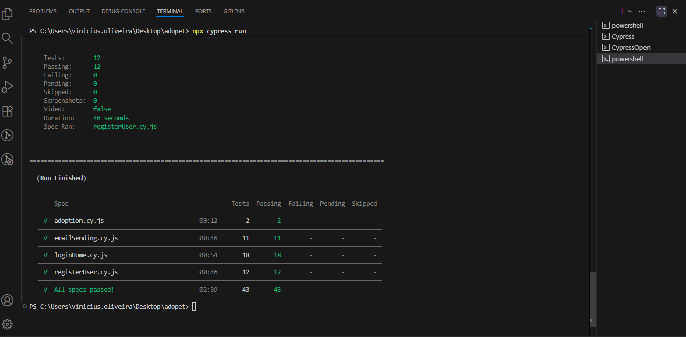

# 🏃‍♂️ Adopet Automation
Projeto desenvolvido com o objetivo de estudar automações utilizando o Cypress. Nele foi criada uma bateria de testes abrangendo todos os cenários possíveis, a fim de validar o comportamento e a estabilidade da aplicação.
---

## 📋 Descrição
Para a escrita dos cenários de teste, utilizei a plataforma Qase, onde cadastrei todos os fluxos do projeto com o objetivo de definir um caminho estruturado para a automação. Caso haja interesse em validar os cenários, deixei anexo abaixo o PDF exportado do Qase contendo todos os cenários de teste.

📎 [Baixar cenários de teste (PDF)](./screen/ADOPET-2025-10-27.pdf)


🎯 Principais Objetivos da Automação – Projeto ADO PET

🧩 1. Conecte-se (Login)

- Validar o fluxo de login com conta já cadastrada.
- Garantir que o sistema bloqueie login com conta não cadastrada.
- Verificar mensagens de erro para campos em branco (e-mail e senha).
- Validar comportamento ao inserir e-mail em formato inválido.
- Confirmar tratamento de caracteres especiais no campo de e-mail.
- Testar o bloqueio após 3 tentativas consecutivas de login inválido.

📝 2. Cadastro

- Validar o fluxo completo de cadastro de novo usuário.
- Garantir o funcionamento correto dos campos obrigatórios.
- Testar mensagens de erro e validações de dados no processo de registro.

✉️ 3. Envio de E-mail

- Validar o fluxo de envio de e-mail com sucesso.
- Testar validações dos campos do formulário:
- Nome com números.
- Nome com caracteres especiais.
- Nome em branco.
- Telefone com letras ou caracteres especiais.
- Telefone com menos de 9 ou mais de 9 dígitos.
- Telefone em branco.
- Nome do animal em branco.

🐾 4. Adoção

- Garantir que o fluxo de adoção de pets funcione corretamente.
- Validar os campos e mensagens apresentados durante o processo.
- Assegurar que os dados enviados sejam processados corretamente.


## 📋 Automação rodando

Execução dos Testes Automatizados

Após a finalização do desenvolvimento da automação, foram realizadas diversas execuções com o objetivo de garantir a qualidade e estabilidade dos testes implementados.

A imagem abaixo demonstra o resultado final da execução, onde todos os testes foram concluídos com sucesso, sem a ocorrência de falhas, pendências ou casos ignorados.

Os testes foram executados por meio da pipeline do VS Code, utilizando o comando npx cypress run.

📄 Resumo da execução:

- Total de testes: 43

- Testes aprovados: 43

- Testes falhos: 0

- Tempo total de execução: 2 minutos e 39 segundos

- Status final: ✅ Todos os testes passaram com sucesso

📎 [Baixar cenários de teste (PDF)](./screen/testRun.png)

🧠 Conclusão

A automação foi executada com êxito, comprovando a eficiência e estabilidade dos fluxos implementados.
Não foram identificadas falhas durante os testes, demonstrando que as funcionalidades principais do sistema estão operando conforme o esperado.

---

## ⚙️ Tecnologias Utilizadas
- **JavaScript / TypeScript**  
- **Cypress** (para automação de testes)  

---

## 🚀 Como Executar
```bash
# Clone o repositório
git clone https://github.com/Matheus-sp12/Adopet-automa-o.git

# Acesse a pasta do projeto
cd seu-projeto

# Instale as dependências
npm install

# Execute a aplicação
npm start


